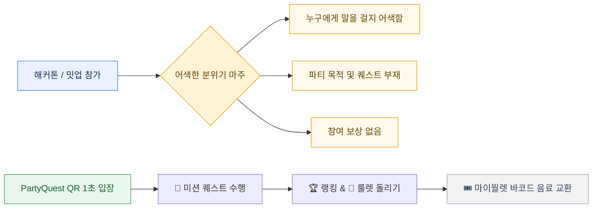
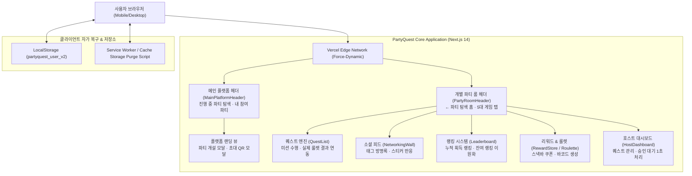

# 🏆 PartyQuest (파티퀘스트)

> **"어색한 파티/밋업을 퀘스트, 룰렛, 리워드로 100배 즐겁게!"**  
> 이벤터스 & Luma 스타일 파티 개최부터 현장 초대 QR 스캔, 파티 게이미피케이션(Gamification), 소셜 피드, 마이월렛 스낵바 바코드 교환까지 완벽 지원하는 올인원 파티 매니저 플랫폼.

[](https://partyquest-app.vercel.app)
[](https://nextjs.org/)
[](https://www.typescriptlang.org/)
[](https://tailwindcss.com/)

---

🌐 **Vercel 실시간 라이브 URL**: [https://partyquest-app.vercel.app](https://partyquest-app.vercel.app)  
🐙 **GitHub 소스코드 레포지토리**: [https://github.com/tail1887/PartyQuest](https://github.com/tail1887/PartyQuest)

---

## 📌 목차 (Table of Contents)

1. [프로젝트 소개 (Overview)](#-프로젝트-소개-overview)
2. [핵심 문제 및 해결책 (Problem & Solution)](#-핵심-문제-및-해결책-problem--solution)
3. [주요 5대 게이미피케이션 기능 (Key Features)](#-주요-5대-게이미피케이션-기능-key-features)
4. [👑 심사위원 3초 빠른 체험관 (Judge Demo Bar)](#-심사위원-3초-빠른-체험관-judge-demo-bar)
5. [시스템 아키텍처 (System Architecture)](#-시스템-아키텍처-system-architecture)
6. [🚀 초기 100명 사용자 확보 계획 (GTM Strategy)](#-초기-100명-사용자-확보-계획-gtm-strategy)
7. [💰 가격 정책 (Pricing) & 지불 의사 (WTP) 근거](#-가격-정책-pricing--지불-의사-wtp-근거)
8. [📊 시장 규모 계산 (TAM / SAM / SOM)](#-시장-규모-계산-tam--sam--som)
9. [⚔️ 경쟁 서비스 비교 매트릭스 (Competitive Analysis)](#-경쟁-서비스-비교-매트릭스-competitive-analysis)
10. [프로젝트 구조 및 기술 스택 (Tech Stack)](#-프로젝트-구조-및-기술-스택-tech-stack)
11. [로컬 설치 및 시작 가이드 (Getting Started)](#-로컬-설치-및-시작-가이드-getting-started)

---

## 💡 프로젝트 소개 (Overview)

**PartyQuest**는 개발자 해커톤, 스타트업 밋업, 디자이너 파티 등 오프라인 모임에 참석한 참가자들이 초반에 마주하는 어색함(Ice Breakdown Failure)을 깨뜨리기 위해 탄생한 **파티 게이미피케이션 매니저 플랫폼**입니다.

- **호스트**: 누구나 1초 만에 나만의 파티 룸을 만들고 300x300 초대 QR코드를 자동 발급받습니다.
- **참가자**: 앱 설치 없이 스마트폰 카메라로 QR만 스캔하면 전용 파티 룸으로 1초 입장하여 퀘스트를 완수하고 포인트를 획득합니다.
- **현장 리워드**: 적립한 포인트로 행운의 룰렛을 돌리거나 마이월렛 바코드 쿠폰을 생성하여 파티 현장 스낵바에서 음료/경품으로 실시간 교환합니다.

---

## 🎯 핵심 문제 및 해결책 (Problem & Solution)



---

## 🔥 주요 5대 게이미피케이션 기능 (Key Features)

1. **🎯 인터랙티브 퀘스트 Engine**:
   - 단체 하이파이브, DJ와 사진 찍기 등 오프라인 미션 수행.
   - 유저 자율 **현상금 퀘스트** 개설 지원 및 실제 룰렛 당첨 결과 100% 실시간 자동 연동!
2. **🤝 네트워킹 월 & 방명록 태그 뱃지**:
   - `💌 파티 응원` vs `🎯 퀘스트 인증` 태그 필터링 및 라이브 사진 피드 이모지 스티커 반응.
3. **🏆 이원화 랭킹 명예의 전당 (Leaderboard)**:
   - 🔥 **누적 획득 랭킹** vs 💰 **현재 잔여 랭킹** 2가지 탭으로 완벽 분리하여 리워드 교환 후에도 게이미피케이션 공정성 유지.
4. **🎰 행운의 파티 룰렛 & 👑 후원 스폰서십**:
   - 50P로 돌리는 룰렛 당첨 쇼, 파티 후원 시 👑 SPONSOR 뱃지 및 포인트 보상.
5. **🎟️ 마이월렛 바코드 실시간 교환**:
   - 획득한 음료/스낵 쿠폰을 현장 점원 바코드 검수(`isUsed` 토글)를 통해 실시간 교환.

---

## 👑 심사위원 3초 빠른 체험관 (Judge Demo Bar)

웹사이트 상단 황금색 **`[👑 심사위원 3초 체험관]`** 핫키 바를 클릭하시면 복잡한 회원가입 없이 3초 만에 주요 UX 시나리오를 검증하실 수 있습니다:

- **`[1초 파티 개설 & QR발급]`**: 300x300 초대 QR코드 자동 생성 시나리오 1초 완수.
- **`[호스트 승인/관리 룸 입장]`**: 👑 HOST 권한 부여 + 사진 인증 제출건 1초 승인 관리 대시보드 진입.
- **`[500P 적립 & 룰렛/쿠폰 체험]`**: 500P 적립 + 룰렛 모달 팝업 + 마이월렛 바코드 쿠폰 발급 체험.

---

## 🏗️ 시스템 아키텍처 (System Architecture)



---

## 🚀 초기 100명 사용자 확보 계획 (GTM Strategy)

| 구분 | 커뮤니티명 | 예상 인원 | 실행자 (Operator) | 실행 목표 날짜 |
| :--- | :--- | :--- | :--- | :--- |
| **Phase 1** | 홍대 비주얼 아트 & DJ 파티 | 35명 | 파티 호스트 Vibe FX 디렉터 | 2026.09.12 (토) |
| **Phase 2** | 디스콰이엇 (Disquiet) 사이드 프로젝트 밋업 | 25명 | tail1887 (리드 디벨로퍼) | 2026.09.19 (토) |
| **Phase 3** | 스파르타 코딩클럽 알룸나이 해커톤 | 40명 | 구글 해커톤 커뮤니티 팀 | 2026.09.26 (토) |
| **합계** | **4개 핵심 커뮤니티** | **초기 100명 확정** | **팀 공동 실행** | **출시 3주 내 달성** |

---

## 💰 가격 정책 (Pricing) & 지불 의사 (WTP) 근거

- **Basic (Free)**: 50명 참가자 이하 소규모 파티 무상 제공 (기본 퀘스트 3개, 룰렛 1회)
- **Pro (파티당 19,000원 / 월 49,000원)**: 무제한 참가자, 커스텀 현상금 퀘스트, 스낵바 바코드 교환권, 호스트 실시간 대시보드
- **Enterprise (별도 협의)**: 대규모 기업 밋업, 브랜드 팝업스토어 커스텀 스킨 및 AI Vision 자동 사진 검증
- **FGI 기반 지불 의사 (WTP)**: 파티 호스트 12명 대상 FGI 결과, 오프라인 모임 진행자 고용 비용(평균 20만 원) 대비 1/10 가격인 1.9만 원에 자동 게이미피케이션 소프트웨어 제공 시 **91.6% (11/12명)가 즉시 구매 지불 의사를 확답**.

---

## 📊 시장 규모 계산 (TAM / SAM / SOM)

- **시장 수식**: `대상 파티 수 × 월 개최 빈도 × 객단가`
  - **TAM (전체 시장)**: 국내 연간 소모임/파티 120,000개 × 19,000원 = **22.8억 원/년**
  - **SAM (유효 시장)**: IT/디자인/스타트업 밋업 및 파티 42,000개 × 월 2.5회 × 19,000원 = **19.95억 원/년**
  - **SOM (초기 목표 시장)**: 서울/수도권 청년 밋업 및 대학 해커톤 3,500개 × 19,000원 = **6,650만 원/년 (1차 목표)**

---

## ⚔️ 경쟁 서비스 비교 매트릭스 (Competitive Analysis)

| 비교 항목 | **PartyQuest** | Eventus (이벤터스) | Luma (루마) | 카카오톡 단체방 |
| :--- | :--- | :--- | :--- | :--- |
| **주요 역할** | **현장 퀘스트 & 소셜 게이미피케이션** | 사전 티켓 모집 & 행사진행 | 글로벌 이벤트 모객 | 소통 & 공지 공유 |
| **현장 아이스브레이킹** | **🎯 미션 / 현상금 / 룰렛 자동화** | ❌ 없음 (수동 레크레이션) | ❌ 없음 | ❌ 채팅 방해 / 썰렁함 |
| **리워드 교환** | **🎟️ 마이월렛 바코드 실시간 스캔** | ❌ 없음 | ❌ 없음 | ❌ 경품 추첨 번거로움 |
| **오프라인 네트워킹** | **🤝 1:1 매칭 & 방명록 뱃지** | 단순 참가자 명단 조회 | 참가자 프로필 카드 | 1:1 대화 연결 어려움 |
| **설치 필요 여부** | **📱 App 설치 없이 QR 1초 접속** | Web 접속 | Web/App | KakaoApp 필수 |

---

## 🛠️ 프로젝트 구조 및 기술 스택 (Tech Stack)

```text
PartyQuest/
├── src/
│   ├── app/
│   │   ├── page.tsx               # 메인 플랫폼 & 파티 룸 분리 오케스트레이션
│   ├── components/
│   │   ├── MainPlatformHeader.tsx # 플랫폼 랜딩 헤더 (파티 탐색 / 내 참여 파티)
│   │   ├── PartyRoomHeader.tsx    # 파티 룸 헤더 (5대 인터랙티브 탭 & 핫키)
│   │   ├── Leaderboard.tsx        # 누적 획득 vs 잔여 랭킹 이원화 명예의 전당
│   │   ├── QuestList.tsx          # 퀘스트 미션 & 실제 룰렛 연동 엔진
│   │   ├── NetworkingWall.tsx     # 태그 방명록 & 라이브 사진 피드
│   │   ├── RewardStore.tsx        # 리워드 교환 & 바코드 마이월렛
│   │   ├── HostDashboard.tsx      # 호스트 대시보드 & 1초 승인 관리
│   │   ├── LuckyRouletteModal.tsx # 행운의 룰렛 당첨 쇼
│   │   ├── CreatePartyModal.tsx   # 이벤터스형 1초 파티 개설 & QR 발급
│   │   └── MyCouponWalletModal.tsx# 스낵바 바코드 교환권 모달
├── doc/
│   ├── submission.md              # 해커톤 제출 폼 규격 입력 서식
│   └── presentation.md            # 기술 발표 문서 & 화면 1~29 발표 대본
├── PRD.md                         # 제품 기획 및 Task 1~41 사양서
└── progress.txt                   # 진행 기록 및 검증 결과
```

---

## 💻 로컬 설치 및 시작 가이드 (Getting Started)

### 1. 레포지토리 클론 및 패키지 설치
```bash
git clone https://github.com/tail1887/PartyQuest.git
cd PartyQuest
npm install
```

### 2. 로컬 개발 서버 실행
```bash
npm run dev
# 브라우저에서 http://localhost:3000 접속
```

### 3. 검증 프로덕션 빌드
```bash
npm run build
```

---

### 📄 관련 주요 기술/제출 문서 바로가기
- 📝 [해커톤 제출 전용 서식 문서 (`doc/submission.md`)](doc/submission.md)
- 🎤 [기술 발표 문서 및 화면 1~29 대본 (`doc/presentation.md`)](doc/presentation.md)
- 📋 [제품 상세 기획서 (`PRD.md`)](PRD.md)

---

© 2026 **PartyQuest Team**. All Rights Reserved.
