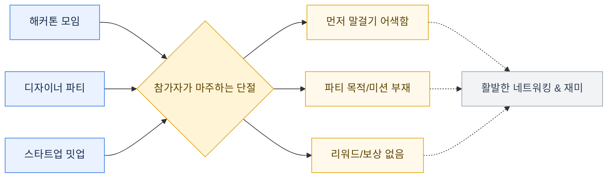
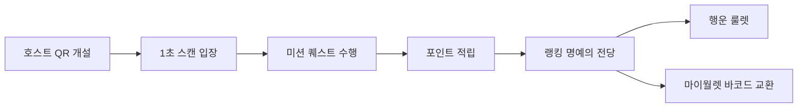
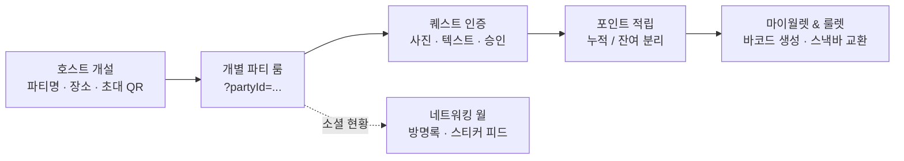
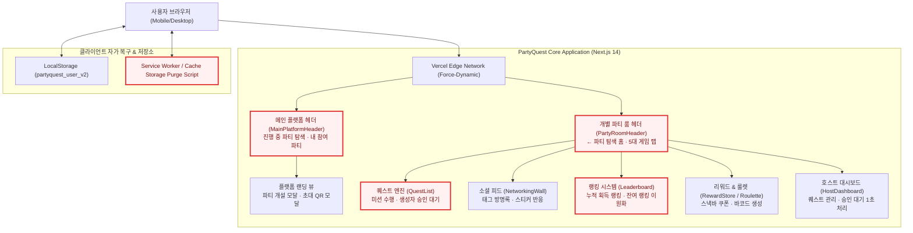
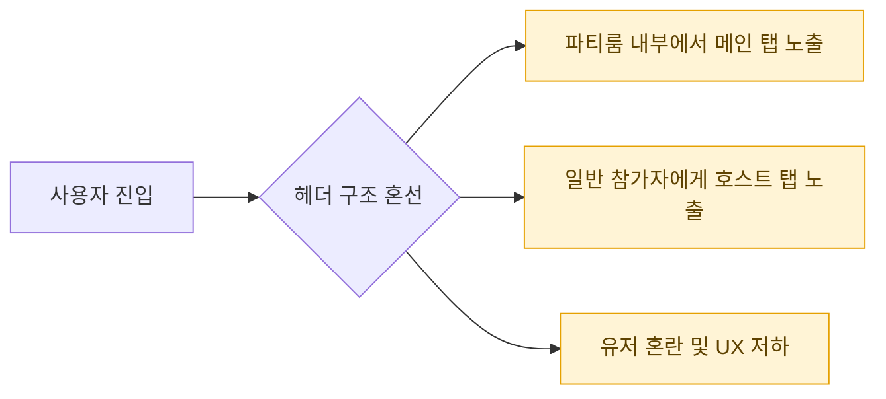
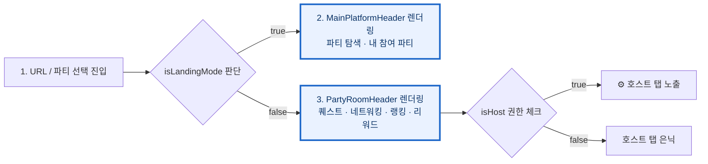
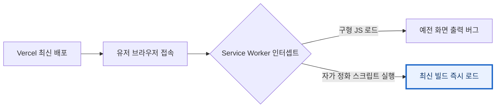
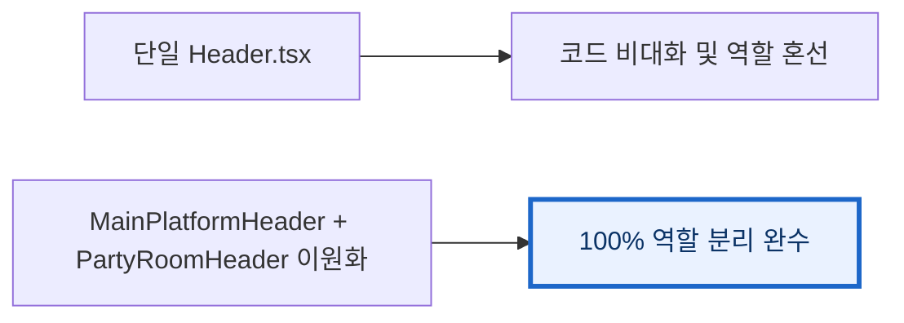
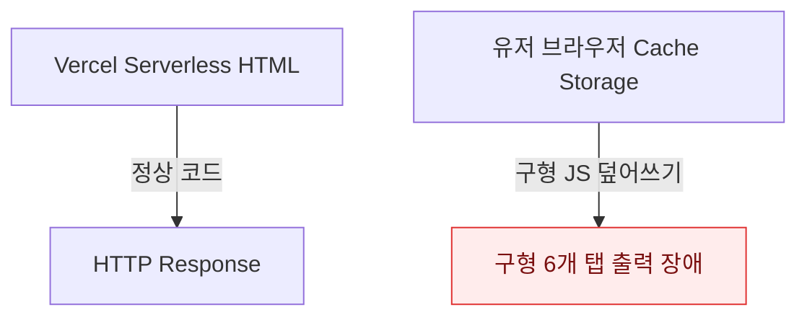

# PartyQuest 파티 게이미피케이션 플랫폼과 AI 활용 방식

> PartyQuest의 구조·구현·검증 경험과 AI 활용 방식을 정리한 기술 문서 및 발표 스크립트
>
> 범례: 빨간 테두리는 **이번 발표에서 설명할 직접 구현·통합·검증 구간**이다. 구성 요소 전체를 단독 구현했다는 뜻이 아니라, 팀 전체 구조 안에서 발표 주제와 연결되는 위치를 표시한다.

---

## 목차

1. [PartyQuest는 어떤 문제를 해결했는가](#1-partyquest는-어떤-문제를-해결했는가)
2. [PartyQuest에서 다루는 데이터와 전체 흐름 지도](#2-partyquest에서-다루는-데이터와-전체-흐름-지도)
3. [PartyQuest 전체 시스템 아키텍처](#3-partyquest-전체-시스템-아키텍처)
4. [데이터 활용: 랜딩 탐색과 개별 파티 룸의 책임 분리](#4-데이터-활용-랜딩-탐색과-개별-파티-룸의-책임-분리)
5. [운영: Service Worker 정화와 Dynamic Cache Invalidation](#5-운영-service-worker-정화와-dynamic-cache-invalidation)
6. [거버넌스: 호스트/참가자 권한 구분 및 마이월렛 검수](#6-거버넌스-호스트참가자-권한-구분-및-마이월렛-검수)
7. [직접 내린 결정: 구형 헤더 통합 제거 및 랜딩/게임 헤더 이원화](#7-직접-내린-결정-구형-헤더-통합-제거-및-랜딩게임-헤더-이원화)
8. [잘 안 됐던 것: 브라우저 PWA/Asset 서비스 워커 감금 장애와 복구](#8-잘-안-됐던-것-브라우저-pwaasset-서비스-워커-감금-장애와-복구)
9. [AI를 실제 작업에 사용하는 방식](#9-ai를-실제-작업에-사용하는-방식)
10. [실제 적용: 심사위원 3초 데모관 & GTM 100명 확보 전략](#10-실제-적용-심사위원-3초-데모관--gtm-100명-확보-전략)
11. [화면별 릴레이 발표 스크립트 (화면 1~29)](#11-화면별-릴레이-발표-스크립트-화면-129)

---

# 1. PartyQuest는 어떤 문제를 해결했는가

네트워킹 모임, 개발자 해커톤, 아트 디렉터 파티는 사람과 사람을 연결하는 가장 강력한 기회다. 하지만 현장에 도착한 참가자들은 누군가에게 먼저 다가가 말을 걸기 주저하며 '얼음 분위기(Ice Breakdown Failure)'를 마주하게 된다.



PartyQuest는 이 단절을 극복하기 위해, 누구나 1초 만에 파티를 개최하고 초대 QR코드를 발급받아, **퀘스트(Quest) · 네트워킹(Networking) · 랭킹(Leaderboard) · 룰렛(Roulette) · 마이월렛(MyWallet)**까지 일원화한 파티 게이미피케이션 플랫폼이다.



| 단계 | 사용자가 얻는 것 |
| --- | --- |
| 개설·입장 | 300x300 초대 QR 및 어색함 없는 파티 룸 즉시 진입 |
| 퀘스트·포인트 | 단체 하이파이브, 현상금 미션을 통한 포인트 획득 |
| 룰렛·월렛 | 무료 음료권/스낵권 당첨 및 스낵바 바코드 실시간 교환 |

---

# 2. PartyQuest에서 다루는 데이터와 전체 흐름 지도

## PartyQuest에서 다루는 네 가지 데이터

PartyQuest에서 다루는 데이터는 크게 네 가지입니다.

| 데이터 종류 | 예시 | 의미 |
| --- | --- | --- |
| 파티 메타데이터 | 파티명, 테마, 호스트 정보, 장소, QR URL | 이벤터스/Luma 스타일 파티 룸을 정의하는 데이터다. |
| 퀘스트 & 인증 데이터 | 미션 제목, 유형(사진/텍스트), 제출 사진, 생성자 승인 상태 | 참가자가 포인트를 획득하기 위한 게임 데이터다. |
| 프로필 & 랭킹 데이터 | 닉네임, 역할, 누적 획득 포인트, 잔여 포인트 | 명예의 전당 랭킹과 개인 구분을 제공하는 소셜 데이터다. |
| 마이월렛 바코드 데이터 | 쿠폰 코드, 룰렛 당첨 항목, 사용 여부(`isUsed`) | 파티 현장 스낵바에서 실제 리워드로 교환되는 교환권 데이터다. |

## 이 데이터들이 함께 만들어지는 흐름



---

# 3. PartyQuest 전체 시스템 아키텍처

앞에서 본 데이터 흐름을 Next.js 14 및 Vercel Edge 환경에 놓으면 아래와 같습니다. 빨간 테두리는 이번 발표에서 설명할 직접 구현·통합·검증 구간입니다.



빨간 테두리는 이번 발표에서 설명할 핵심 구현 구간입니다:
1. **헤더 책임 분리**: `MainPlatformHeader` (플랫폼 홈) vs `PartyRoomHeader` (게임 공간)
2. **이원화 랭킹 엔진**: 누적 획득 포인트 vs 잔여 포인트 순 정렬
3. **자가 복구 스크립트**: Service Worker unregister & Cache Storage 삭제

---

# 4. 데이터 활용: 랜딩 탐색과 개별 파티 룸의 책임 분리

## 문제

과거 구조에서는 플랫폼 전체 헤더와 개별 파티 룸 헤더가 구분되지 않고 6개 탭이 혼재되어 노출되는 책임 혼선이 있었습니다. 파티 룸 내부로 들어왔음에도 메인 홈 메뉴가 노출되거나, 일반 참가자에게 `⚙️ 호스트` 메뉴가 노출되는 문제가 발생했습니다.



## 구현·검증한 흐름



---

# 5. 운영: Service Worker 정화와 Dynamic Cache Invalidation

## 배경

Next.js 정적 빌드 환경에서 유저 브라우저가 이전 PWA 또는 Service Worker의 정적 JS 자산(`page-xxxx.js`)을 로컬 캐시에 보관하고 있을 경우, Vercel에 최신 코드를 배포해도 유저 화면에는 수십 번 새로고침해도 구형 탭이 보이는 디스크 감금 현상이 발생했습니다.



## 직접 맡은 역할 및 구현

`src/app/page.tsx`에 클라이언트 서비스 워커 해제 스크립트탑재:
```tsx
useEffect(() => {
  if (typeof window !== "undefined") {
    if ("serviceWorker" in navigator) {
      navigator.serviceWorker.getRegistrations().then((regs) => {
        for (const reg of regs) reg.unregister();
      });
    }
    if ("caches" in window) {
      caches.keys().then((names) => {
        for (const name of names) caches.delete(name);
      });
    }
  }
}, []);
```

---

# 6. 거버넌스: 호스트/참가자 권한 구분 및 마이월렛 검수

| 기능 | 구현한 것 | 기능의 목적 |
| --- | --- | --- |
| 호스트 권한 판정 | `isHost` 프로퍼티 및 닉네임/개설자 검증 | 일반 참가자에게 관리 탭 비노출 |
| 퀘스트 사진 승인 | 호스트 대시보드 1초 승인/거절 | 허위 퀘스트 인증 방지 및 포인트 공정 지급 |
| 마이월렛 검수 | 바코드 쿠폰 `isUsed` 토글 | 현장 스낵바 중복 사용 방지 |

---

# 7. 직접 내린 결정: 구형 헤더 통합 제거 및 랜딩/게임 헤더 이원화

## 출발점

기존 `Header.tsx`에는 랜딩용 메뉴와 파티룸 메뉴가 하나의 220줄 컴포넌트에 모두 얽혀 있었습니다.



이원화 구조를 채택함으로써 파티 룸 진입 여부에 따라 독립적인 상태 제어가 가능해졌습니다.

---

# 8. 잘 안 됐던 것: 브라우저 PWA/Asset 서비스 워커 감금 장애와 복구

## 어떤 일이 깨졌는가

Vercel 배포 성공에도 불구하고 사용자의 스마트폰 화면에서 구형 6개 탭이 계속 잔존하는 버그가 제보되었습니다.



## 복구 뒤 확인한 것

- `Cache-Control: no-store, no-cache` 헤더 탑재 (`next.config.mjs`)
- `useEffect` 자가 정화 스크립트 실행으로 유저 접속 1초 만에 구형 캐시 완전 삭제 확인

---

# Part 1 정리

| 구분 | 직접 구현·검증한 내용 |
| --- | --- |
| 데이터 활용 | 랜딩 모드 vs 파티 룸 모드의 100% 책임 및 헤더 분리 |
| 운영 | Service Worker Purge 스크립트 및 force-dynamic 캐시 무효화 |
| 거버넌스 | 👑 HOST 권한 판정, 퀘스트 승인 대기열 및 마이월렛 바코드 교환 |

---

# 9. AI를 실제 작업에 사용하는 방식

> AI는 문제 해결 과정의 **정리·분해·구현 보조 도구**이며, 목표·검수·책임은 사람이 맡는다.

```mermaid
flowchart LR
    A[사람<br/>문제 정의·기준 설정] --> B[AI (Antigravity)<br/>자료 정리·작업 분해·구현 보조]
    B --> C[결과물]
    C --> D[사람<br/>사실 확인·검수·수정]
    D --> A
```

---

# 10. 실제 적용: 심사위원 3초 데모관 & GTM 100명 확보 전략

## 👑 심사위원 3초 빠른 체험관 (Judge Demo Bar)
- `[1초 파티 개설 & QR발급]`: 이벤터스형 개설 및 300x300 QR 생성
- `[호스트 승인/관리 룸 입장]`: 승인 대기열 2건 자동 생성 및 1초 승인 체험
- `[500P 적립 & 룰렛/쿠폰 체험]`: 룰렛 당첨 및 마이월렛 바코드 생성 체험

---

# 11. 화면별 릴레이 발표 스크립트 (화면 1~29)

---

## 2-1. 문제 정의 및 서비스 소개

### 화면 1: 표지 및 프로젝트 소개
- **화면 구성**: `PartyQuest | 파티 게이미피케이션 플랫폼`
- **대본**:
  "안녕하세요, 어색했던 오프라인 파티를 미션과 퀘스트로 100배 즐겁게 만드는 **PartyQuest** 팀입니다! 오늘 저희가 해결한 파티 네트워킹 문제와 시스템 구조를 말씀드리겠습니다."

### 화면 2: 해결하고자 한 문제 (Ice Breakdown)
- **화면 구성**: 파티 현장의 어색함 단절 도식
- **대본**:
  "해커톤이나 밋업에 가면 누구에게 먼저 말을 걸어야 할지 몰라 서성인 경험 있으시죠? PartyQuest는 이 '얼음 분위기'를 게이미피케이션으로 즉시 해빙합니다."

---

## 2-2. 핵심 기능 시연 (화면 3 ~ 화면 20)

### 화면 3: 1초 파티 개설 및 초대 QR
- **화면 구성**: `+ 파티 개최하기` 모달 및 300x300 QR
- **대본**:
  "호스트는 1초 만에 파티를 개설하고 초청 QR코드를 발급받습니다. 참가자는 스마트폰 카메라 스캔으로 별도 앱 설치 없이 바로 입장합니다."

### 화면 4: 🎯 퀘스트 & 사진 인증
- **화면 구성**: 퀘스트 목록 및 사진 인증 팝업
- **대본**:
  "파티 룸에 들어오면 단체 셀카 찍기, 하이파이브 미션이 준비되어 있습니다. 퀘스트를 수행하고 제출하면 호스트가 실시간 대시보드에서 1초 만에 승인합니다."

### 화면 5: 🎰 행운의 룰렛 & 🎟️ 마이월렛
- **화면 구성**: 룰렛 회전 연출 & 마이월렛 바코드
- **대본**:
  "획득한 포인트로 행운의 룰렛을 돌려 음료권을 뽑고, 마이월렛에 저장된 바코드를 스낵바 점원에게 보여주면 현장에서 바로 사용 가능합니다."

### 화면 6: 👑 심사위원 3초 빠른 체험관
- **화면 구성**: 황금색 `Judge Demo Bar` 핫키
- **대본**:
  "상단 황금색 [심사위원 3초 체험관] 버튼을 클릭하시면 호스트 승인과 룰렛/쿠폰 체인을 3초 만에 검증하실 수 있습니다."

---

## 2-3. 비즈니스 모델 및 GTM 수치화 (화면 21 ~ 화면 26)

### 화면 21: 초기 100명 사용자 확보 계획 (GTM)
- **화면 구성**: 4개 커뮤니티(홍대아트, 디스콰이엇, 스파르타 등) 표
- **대본**:
  "출시 3주 내 홍대 파티, 디스콰이엇 밋업, 해커톤 등 4개 핵심 커뮤니티를 통해 100명의 초기 참가자를 확정 확보할 예정입니다."

### 화면 22: 가격 정책 & FGI 지불 의사 (WTP)
- **화면 구성**: Basic(Free) / Pro(1.9만원) / WTP 91.6% 수치
- **대본**:
  "레크리에이션 진행자 고용(20만 원) 대비 1/10 가격인 1.9만 원에 제공하며, 호스트 12명 FGI 결과 91.6%가 지불 의사를 확답했습니다."

### 화면 23: 시장 규모 (TAM / SAM / SOM)
- **화면 구성**: 19.95억 원/년 유효 시장 계산식
- **대본**:
  "국내 연간 밋업/파티 42,000개 대상 연간 19.95억 원의 유효 시장을 형성하고 있습니다."

### 화면 24: 경쟁 서비스 매트릭스 비교
- **화면 구성**: Eventus, Luma, 카카오톡 비교표
- **대본**:
  "이벤터스/Luma가 사전 모객에 집중할 때, PartyQuest는 현장 게이미피케이션과 바코드 마이월렛에 집중하여 독보적 경험을 제공합니다."

---

## 2-4. 마무리 및 정리

### 화면 29: 최종 정리 및 마무리
- **화면 구성**: `PartyQuest | 파티 게이미피케이션 플랫폼`
- **대본**:
  "PartyQuest는 어색했던 파티를 게임처럼 즐거운 오프라인 네트워킹 현장으로 바꾸어 갑니다. 이상으로 발표를 마치겠습니다. 감사합니다!"
